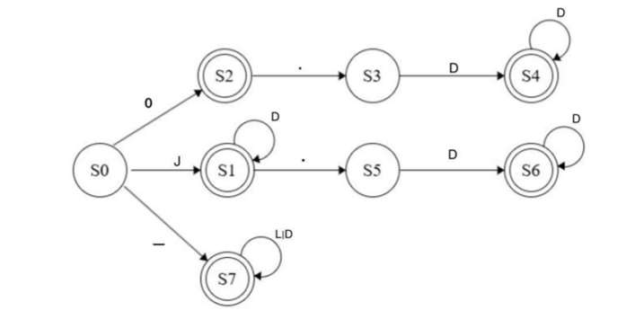

# Compiler Construction Scanner

A Java-based lexical analyzer (scanner) developed as part of a Compiler Construction project using DFA transitions and regular expressions.

---

## Project Overview

This project implements the scanner phase of a compiler, also known as the lexical analyzer.

The scanner processes source code as a stream of characters and classifies them into meaningful tokens such as:
- Keywords
- Identifiers
- Numbers
- Operators
- End-of-line symbols

The project was implemented using Java and DFA-based token recognition techniques.

---

## Features

- Lexical analysis
- Token classification
- Identifier recognition
- Number recognition
- Operator recognition
- Error detection
- DFA-based transitions
- File input processing

---

## Technologies Used

- Java
- DFA (Deterministic Finite Automata)
- Regular Expressions
- Compiler Construction Concepts

---

## Programming Language Definition

The scanner recognizes:

### Keywords

```txt
if, int, float, for, else, enum, do, double, default, case
```

### Operators

```txt
+, -, *, /, ==, !=, >=, <=, !, &, &&, %, |, ||, =, <, >, (, ), {, }
```

### Identifiers

Identifiers begin with:

```txt
_
```

followed by letters or digits.

### Numbers

The scanner supports:
- Integer values
- Decimal values

---

## Regular Expression

```txt
0|0.D+|JD*|JD*.D+|_(L|D)*
```

The regular expression was used to define valid identifiers and numbers for the scanner.

---

## DFA Design

The scanner logic was implemented using DFA transitions between multiple states including:
- S0
- S1
- S2
- S3
- S4
- S5
- S6
- S7
- Se

The DFA handles transitions for:
- Identifiers
- Numbers
- Decimal values
- Invalid tokens

### DFA Diagram



---

## Scanner Workflow

The scanner performs the following steps:

1. Read source code from a file
2. Split input into lexemes
3. Check token type
4. Apply DFA transitions
5. Print token classifications
6. Detect invalid tokens

The scanner uses methods such as:
- `readFile()`
- `getLaxeme()`
- `evaluate()`
- `executeTransition()`

---

## Example Input

```txt
int _ah = 5 ;
float b = 6.7 ;
if ( a < b ) }
```

The scanner analyzes identifiers, operators, numbers, and invalid tokens using DFA transitions.

---

## Program Output

### Scanner Output


The output demonstrates:
- Keyword recognition
- Operator classification
- Identifier detection
- Number detection
- Error handling

---

## Error Handling

The scanner detects invalid tokens and reports:
- Invalid identifiers
- Syntax formatting issues
- Incorrect token structures

Example:

```txt
ERROR...a Invalid at line : 3
```

---

## Learning Outcomes

This project helped improve understanding of:
- Compiler construction
- Lexical analysis
- DFA implementation
- Regular expressions
- Tokenization
- State transitions
- Java programming

---

## Future Improvements

- Parser implementation
- Syntax analysis support
- GUI interface
- More complex grammar support
- Semantic analysis integration

---

## Team Members

- Huda Ali Majrashi
- Jana Ibrahim Alotaibi
- Mayar Faisal Alharbi
